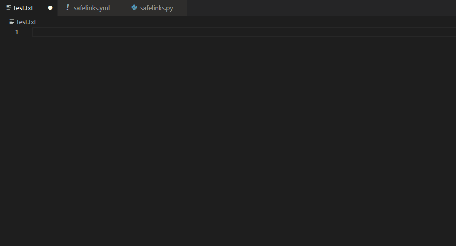

# Useful Espanso Extensions

These are my [espanso](https://espanso.org/) scripts that I use in my day-to-day life.

## Trigger: `:sl`

When there is an Outlook "Safelink" in the clipboard, this will print the decoded safelink.

Example:
`https://nam06.safelinks.protection.outlook.com/?url=https%3A%2F%2Fbing.com&data=foo`

Becomes:
`https://bing.com`

### Demo

## Trigger: `:dh`

Prints the header that I use for meetings:

Example: `### [[2022-01-19-Wed]]`